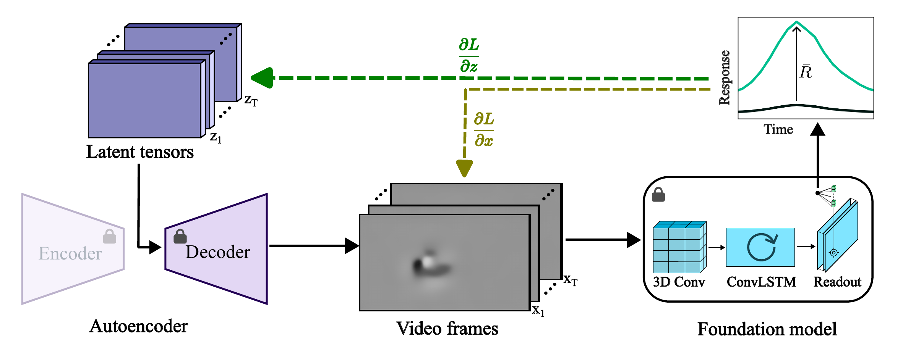

# Most Exciting Dynamic Inputs (MEDIs) for Mouse Visual Cortex

[[`Paper`](https://github.com/Altervoke/mouse_medi)] [[`Code`](https://github.com/Altervoke/mouse_medi)]

This repository contains the code for synthesizing most exciting dynamic inputs (MEDIs) — short videos that maximally activate a given neuron in a deep predictive model of the mouse visual cortex, and for all further experiments. The method is built on the MICrONS digital twin foundation model [Wang et al., Nature 2025] and uses latent‑space optimization to generate naturalistic, high‑driving stimuli.

## Overview

<p align="center">
  
</p>

Iterative optimization pipeline for generating MEDI. Video frames are passed to the model to compute predicted responses and the loss is backpropagated. Dark yellow path (pixel space): the frames are updated according to the gradient $\frac{\partial \mathcal{L}}{\partial \mathbf{x}}$. Green path (latent space): the latent tensors are updated according to the gradient $\frac{\partial \mathcal{L}}{\partial \mathbf{z}}$.

## Requirements

### Hardware
- CPU‑only execution is possible, but a modern GPU (NVIDIA 3090 or better) is strongly recommended.

### Software
- Python 3.8+
- Linux (tested on Ubuntu 20.04, 22.04) or Windows Subsystem for Linux (WSL2)

## Installation

### Step 1: Clone this repository

```bash
git clone https://github.com/Altervoke/mouse_medi
cd mouse_medi
```

### Step 2: Install the FNN foundation model

The synthesis pipeline depends on the FNN (Foundation Neural Network) digital twin package. It must be installed in the parent directory of `mouse_medi` (i.e., at the same level as this README).

```bash
cd ..
git clone https://github.com/cajal/fnn.git
cd fnn
pip install -e .
cd ../mouse_medi
```

Please follow the instructions in the [FNN repository](https://github.com/cajal/fnn) and download microns digital twin and its properties (containing neural responses and stimulus).

### Step 3: Install Python dependencies

```bash
pip install -r requirements.txt
```

## Usage

All steps are orchestrated in the tutorial notebook: 
`mouse_medi/tutorial.ipynb`

Run it inside the repository with:

```bash
jupyter notebook mouse_medi/tutorial.ipynb
```

or launch Jupyter Lab from the project root.

## Repository Structure

```
mouse_medi/
├── config/              # Paths and global settings
├── generation/          # MEDI/MESI/Gabor synthesis (optimizer, generator, TAESD)
├── features/            # Feature extraction from MEDIs and gratings
├── scripts/             # Executable scripts for data processing and generation
├── visualization/       # Figure generation scripts (Fig 2‑6, Appendix)
├── data/                # Metadata and computed features
├── figures/             # Output figures (PDF)
├── tutorial.ipynb       # Step‑by‑step guide
└── requirements.txt
```
